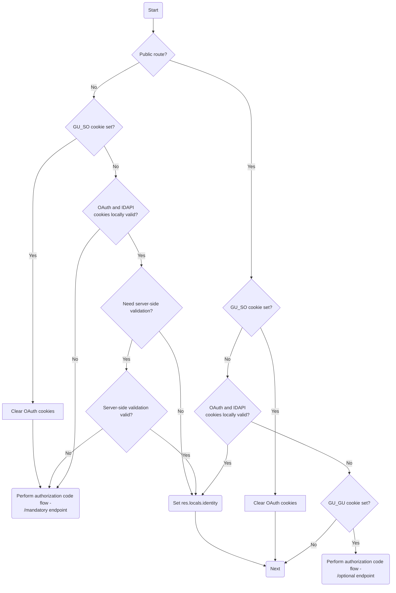

# Identity Middleware

The identity middleware is responsible for controlling access to MMA.

Most routes on MMA are 'mandatory sign-in' routes, requiring the user to be
signed in to access them. For these routes, the identity middleware is responsible
for validating the user's OAuth tokens and performing an authorization code flow
if necessary.

Some routes, mostly connected to the Help Centre, are 'optional sign-in' routes.
For these routes, the identity middleware will attempt to validate the user's
OAuth tokens if they have an active Okta session, and will otherwise allow the user
to access the route in a signed-out state.

## Middleware flow

